# Malazan Network Analysis Report

## Introduction

> - Bugg's Construction will be the first major enterprise to collapse.   
> - And how many will it drag down with it?
> - No telling. Three, maybe four.
> - I thought you said there was no telling.
> - So don't tell anyone.
> - Good idea, Bugg.
>
> ― Steven Erikson, The Malazan Book of the Fallen

In this Network Analysis of the first 9 books (out of 10) of the Malazan Book of the Fallen I am analysing
the interaction Graph between characters from the Network Analysis perspective. It's ever more interesting to do that
for complexity of this book causes nothing but awe.

**Spoiler Alert: there are many spoilers :)**

## Network Summary
[Link to Cosmograph (use files from /data/processed to draw a Graph).](https://cosmograph.app/run/)

- **Data Collection & Preprocessing Process**:
    - Characters co-occurrence and POV count of words were taken from
      this [GitHub repo](https://github.com/visuelledata/malazannetwork/)
    - I have manually corrected some mistakes in the datasets above
    - Then I've parsed some of the Malazan-wiki pages in order to:
      a) Get extra information about characters in order to be able to differentiate characters based on their gender,
      race, affiliation;
      b) Using regEx parse attributes, which were mentioned in  (a), from info Dramatis Personea characters description;
      c) Enrich characters data with first (a), and when not enough information was found then already (b) for I trust
  Malazan Wiki more than my regEx;
    - Removed edges where number of alleged contacts was lower than 5
    - Unfortunately, I had to remove Hood and Maybe from the network because the name Hood is a part of colloquial
  expressions ("Hood's breath", "Hood's balls", "Hood take me", etc.) and the word `maybe` oftentimes stand in the beginning of the sentence.
- **Graph type**: undirected homogeneous weighted
- **Nodes attributes**: `gender`, `race`, `affiliation`, `warrens`, `occupation`, `POV words count`,
  `Number of books character appeared in`
- **Edges attributes**: `Number of times personages interacted`. To be more specific, it's the number of times names
  stood close to each other in the text, what we, with some error, may interpret as how many times they interacted
- **Number of Connected Components**: 7
- **Greatest Connected Component Size, share**: 0.982
- **Diameter (largest CC)**: 9
- **Radius (largest CC)**: 5
- **Global Clustering Coefficient**: 0.295
- **Average Clustering Coefficient**: 0.52
  

  
Click to show plot

  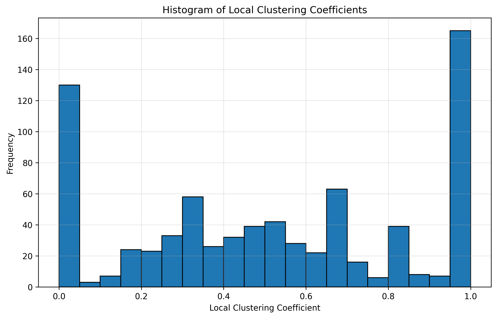
  

- **Average Shortest Path Length (largest CC)**: 3.492
  

  
Click to show plot

  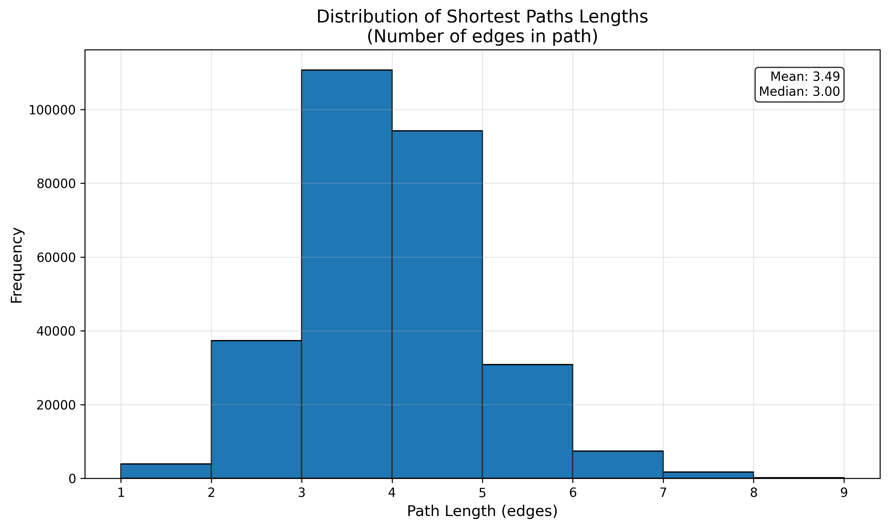
  

- **Power Degree Distribution**
  

  
Click to show plots

  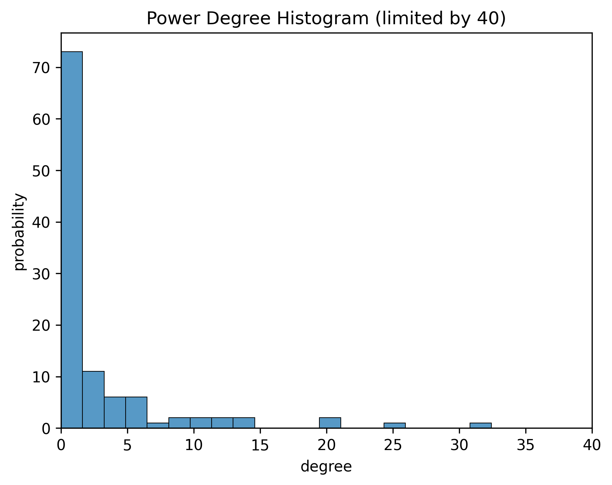
  
  
  

- **Results Interpretation:** Non-surprisingly, it can be seen from *Average Clustering Coefficient* and the histogram of
*Local Clustering Coefficients* that the characters form the largest connected component are well-connected to each other.
Nonetheless, there are many personae, as it can be seen from the *Power Degree Distribution*, that have only 1 or 2 connections.
Those are largely either short-lived characters or briefly-mentioned ones, names of which I can hardly recognize.

## Structural Analysis
- **Network Comparison with Randomly Generated Graphs.**
  

  
Click to show plots

  
  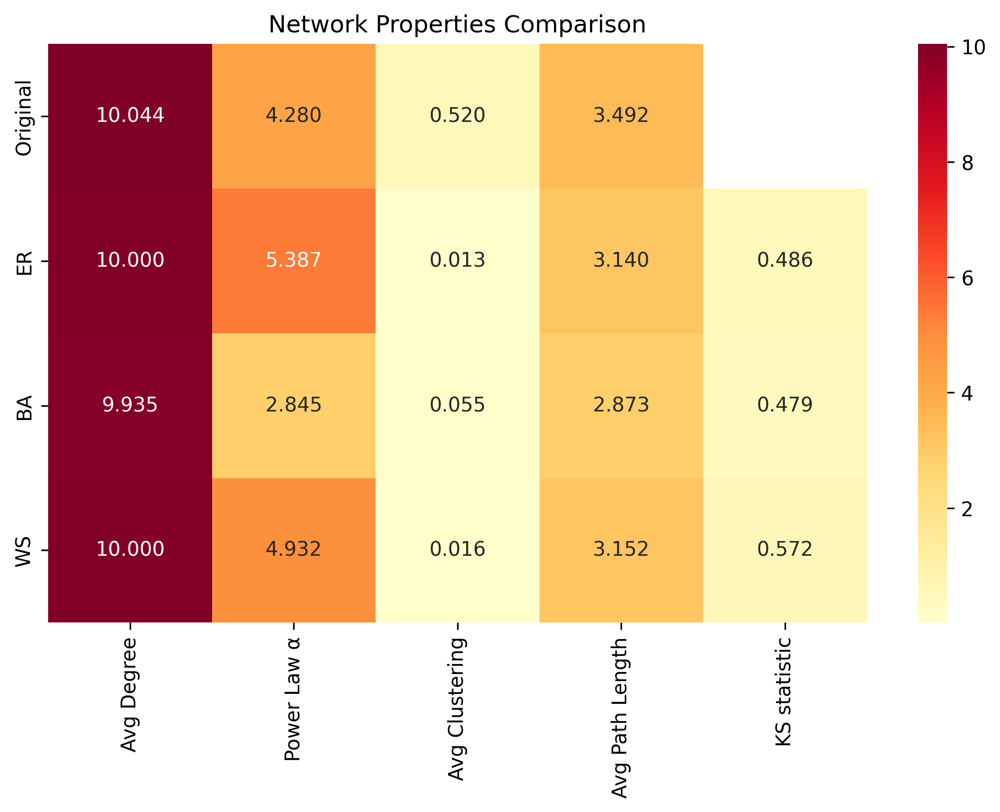
  

- **Centralities**:
  

  
For reference here is POV words count for every character

  
  
  
    | id               | gender   | info                                                                                                                  | profession   |   total_words_count |   books_appearance |   first_book_appearance |   last_book_appearance | affiliation_first      | race_first   |    degree |   closeness |   betweenness |   eigenvector |   pagerank |   core_number |   k_clique_percolation |   louvain_community |   asyn_lpa_community |
    |:-----------------|:---------|:----------------------------------------------------------------------------------------------------------------------|:-------------|--------------------:|-------------------:|------------------------:|-----------------------:|:-----------------------|:-------------|----------:|------------:|--------------:|--------------:|-----------:|--------------:|-----------------------:|--------------------:|---------------------:|
    | Karsa Orlong     | Male     | a Teblor Toblakai warrior of the Uryd Tribe of the Teblor, Sha’ik’s bodyguard, Army of the Apocalypse                 | Bodyguard    |              106663 |                  5 |                       4 |                     10 | Army of the Apocalypse | Teblor       | 0.0415584 |    0.357541 |    0.0421588  |     0.039982  | 0.00451436 |            12 |                      1 |                   3 |                   28 |
    | Fiddler          | nan      | renowned sapper, 9th Squad, Bridgeburners, later Sergeant 14th Army, 8th Legion, 9th Company, 4th Squad, then Captain | Captain      |              103197 |                  6 |                       2 |                     10 | Malazan Empire         | Human        | 0.12987   |    0.421496 |    0.0686403  |     0.224605  | 0.00921249 |            15 |                      1 |                   7 |                    0 |
    | Kalam Mekhar     | Male     | 9th Squad Bridgburners, assassin,  ex-Claw from Seven Cities                                                          | Assassin     |              102930 |                  5 |                       1 |                     10 | Malazan Empire         | Human        | 0.0779221 |    0.397353 |    0.0284638  |     0.140003  | 0.006363   |            14 |                      1 |                   1 |                    0 |
    | Duiker           | nan      | Malazan Imperial Historian attached to the Malazan 7th Army                                                           | Historian    |               89659 |                  2 |                       2 |                      8 | Malazan Empire         | Human        | 0.0636364 |    0.363138 |    0.0169033  |     0.103577  | 0.00500431 |            14 |                      1 |                   6 |                   24 |
    | Trull Sengar     | nan      | a Tiste Edur warrior, master of spear-fighting, betrothed to Seren Pedac                                              | Warrior      |               73101 |                  4 |                       4 |                      7 | nan                    | Tiste Edur   | 0.0701299 |    0.368914 |    0.0449158  |     0.040935  | 0.0067595  |            11 |                     15 |                   9 |                   16 |
    | Seren Pedac      | Female   | a Letherii Acquitor, one of The Hunted                                                                                | nan          |               66767 |                  3 |                       5 |                      9 | Kingdom of Lether      | Human        | 0.0350649 |    0.348804 |    0.0185114  |     0.0214968 | 0.00375471 |            10 |                      2 |                   8 |                   16 |
    | Bottle           | Male     | a squad mage, 9th Company, 4th squad, 8th Legion, Malazan 14th Army                                                   | Mage         |               62131 |                  5 |                       4 |                     10 | Malazan Empire         | Human        | 0.0727273 |    0.382803 |    0.0109678  |     0.158942  | 0.00467658 |            15 |                      1 |                   7 |                    0 |
    | Crokus Younghand | Male     | aka Cutter, thief and assassin from Darujhistan                                                                       | Assassin     |               61068 |                  5 |                       1 |                     10 | Darujhistan            | Human        | 0.0584416 |    0.377354 |    0.028471   |     0.0690289 | 0.00536924 |            14 |                      7 |                   1 |                    0 |
    | Brys Beddict     | Male     | Letherii, Finadd and King's Champion, youngest of the Beddict brothers, Commander of the Letherii Army                | Champion     |               58943 |                  4 |                       5 |                     10 | Kingdom of Lether      | Human        | 0.074026  |    0.383198 |    0.0469647  |     0.0788487 | 0.00696695 |            13 |                     16 |                   8 |                   15 |
    | Felisin Paran    | Female   | younger sister to Ganoes and Tavore, aka Sha'ik Reborn, Chosen One of the Whirlwind Goddess                           | Goddess      |               58060 |                  2 |                       2 |                      4 | Malazan Empire         | Human        | 0.0337662 |    0.351613 |    0.00515066 |     0.0569469 | 0.0026777  |            13 |                      1 |                   6 |                   33 |
    | Udinaas          | Male     | a Letherii slave among the Tiste Edur, father of Rud Elalle, one of the hunted, resident of the Refugium              | Slave        |               57810 |                  4 |                       5 |                     10 | Kingdom of Lether      | Human        | 0.0441558 |    0.33986  |    0.0111675  |     0.0186426 | 0.00420627 |            10 |                      2 |                   8 |                   16 |
    | Toc the Younger  | Male     | Claw, Malazan scout 2nd Army, imprisoned and tortured by the Pannion Seer, Herald of High House Death                 | Scout        |               55955 |                  6 |                       1 |                     10 | Malazan Empire         | Human        | 0.0168831 |    0.330478 |    0.00444924 |     0.0183726 | 0.00180215 |             6 |                     -1 |                   5 |                    3 |
    | Gruntle          | nan      | a caravan guard, Mortal Sword of Trake/Treach, Shareholder, Trygalle Trade Guild                                      | Mortal Sword |               53110 |                  3 |                       3 |                     10 | Trygalle Trade Guild   | Human        | 0.0688312 |    0.371127 |    0.0428485  |     0.0623925 | 0.00635134 |            14 |                     11 |                   5 |                   26 |
    | Samar Dev        | Female   | a scholar and witch from Seven Cities, companion of Karsa Orlong                                                      | Witch        |               50784 |                  4 |                       6 |                     10 | nan                    | Human        | 0.012987  |    0.319249 |    0.0010163  |     0.0118172 | 0.00135817 |             7 |                     -1 |                   8 |                   28 |
    | Itkovian         | nan      | of Elingarth, Shield Anvil of Fener's Reve the Grey Swords, the Redeemer                                              | Shield Anvil |               50290 |                  2 |                       3 |                      8 | nan                    | Human        | 0.0363636 |    0.348804 |    0.0165799  |     0.0458782 | 0.00380697 |            13 |                      4 |                   1 |                   27 |

  

  

  
Degree Centrality

  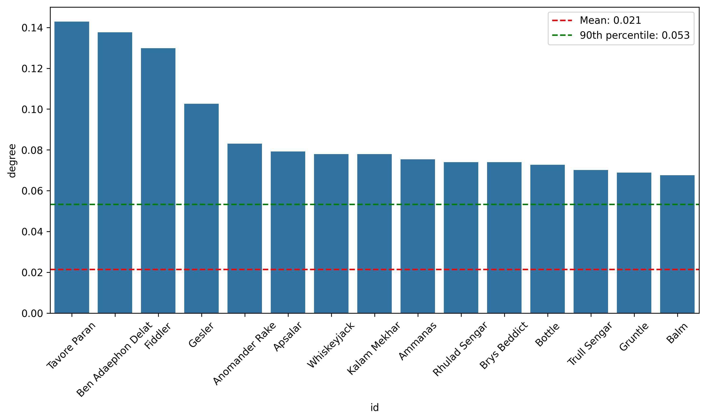
  
    | id                 | gender   | info                                                                                                                                                                                                                                    | profession   |   total_words_count |   books_appearance |   first_book_appearance |   last_book_appearance | affiliation_first    | race_first   |    degree |   closeness |   betweenness |   eigenvector |   pagerank |   core_number |   k_clique_percolation |   louvain_community |   asyn_lpa_community |
    |:-------------------|:---------|:----------------------------------------------------------------------------------------------------------------------------------------------------------------------------------------------------------------------------------------|:-------------|--------------------:|-------------------:|------------------------:|-----------------------:|:---------------------|:-------------|----------:|------------:|--------------:|--------------:|-----------:|--------------:|-----------------------:|--------------------:|---------------------:|
    | Tavore Paran       | Female   | Adjunct to Empress Laseen, Commander of the Malazan 14th Army, sister of Ganoes and Felisin                                                                                                                                             | Commander    |                2145 |                  2 |                       6 |                     10 | Malazan Empire       | Human        | 0.142857  |    0.429545 |     0.094029  |     0.217211  | 0.0111748  |            15 |                     13 |                   6 |                    1 |
    | Ben Adaephon Delat | Male     | aka Quick Ben, enigmatic Bridgeburner squad mage later High Mage                                                                                                                                                                        | High Mage    |               31253 |                  6 |                       1 |                     10 | Malazan Empire       | Human        | 0.137662  |    0.445799 |     0.107166  |     0.210665  | 0.0105899  |            15 |                     14 |                   1 |                    0 |
    | Fiddler            | nan      | renowned sapper, 9th Squad, Bridgeburners, later Sergeant 14th Army, 8th Legion, 9th Company, 4th Squad, then Captain                                                                                                                   | Captain      |              103197 |                  6 |                       2 |                     10 | Malazan Empire       | Human        | 0.12987   |    0.421496 |     0.0686403 |     0.224605  | 0.00921249 |            15 |                      1 |                   7 |                    0 |
    | Gesler             | Male     | ex-corporal Costal Guard, Sergeant, 9th Company, 8th Legion, Malazan 14th Army, attached to the K'Chain Che'Malle as Mortal Sword                                                                                                       | Mortal Sword |               18783 |                  5 |                       4 |                     10 | Malazan Empire       | Human        | 0.102597  |    0.404058 |     0.0459056 |     0.178655  | 0.00723979 |            15 |                     17 |                   7 |                    0 |
    | Anomander Rake     | Male     | -, a Soletaken Tiste Andii Eleint, Ascendant, brother of Silchas Ruin and Andarist, leader of the Tiste Andii in Black Coral, aka Anomandaris Purake, First Son of Darkness,  Lord of Moon's Spawn, Son of Darkness, Knight of Darkness | Ascendant    |                4076 |                  3 |                       1 |                      8 | nan                  | Tiste Andii  | 0.0831169 |    0.397778 |     0.0520967 |     0.0977678 | 0.00758383 |            14 |                     10 |                   1 |                    2 |
    | Apsalar            | Female   | -, aka Sorry, aka not-Apsalar, 9th Squad, Bridgeburners, an assassin                                                                                                                                                                    | Assassin     |               32604 |                  3 |                       1 |                      6 | nan                  | Human        | 0.0792208 |    0.409181 |     0.0313532 |     0.151144  | 0.00588279 |            15 |                      7 |                   1 |                    0 |
    | Whiskeyjack        | nan      | once went by Jack, sergeant of the Bridgeburners' 9th squad, Old Guard, aka Iskar Jarak, past 2nd Army Commander                                                                                                                        | Guard        |               47344 |                  2 |                       1 |                      3 | Malazan Empire       | Human        | 0.0779221 |    0.404278 |     0.0178751 |     0.143569  | 0.00586063 |            14 |                      1 |                   1 |                    0 |
    | Kalam Mekhar       | Male     | 9th Squad Bridgburners, assassin,  ex-Claw from Seven Cities                                                                                                                                                                            | Assassin     |              102930 |                  5 |                       1 |                     10 | Malazan Empire       | Human        | 0.0779221 |    0.397353 |     0.0284638 |     0.140003  | 0.006363   |            14 |                      1 |                   1 |                    0 |
    | Ammanas            | Male     | , an Ascendant, ruler of Shadow, King of High House Shadow, aka Shadowthrone, aka Kellanved founder and Emperor of the Malazan Empire, aka Wu (mage)                                                                                    | Mage         |                2457 |                  3 |                       4 |                     10 | nan                  | Human        | 0.0753247 |    0.416763 |     0.035159  |     0.129632  | 0.00605959 |            14 |                      1 |                   1 |                    0 |
    | Rhulad Sengar      | nan      | Tiste Edur, aka Emperor of a Thousand Deaths, youngest Son of Tomad Sengar and Uruth                                                                                                                                                    | Emperor      |                2592 |                  2 |                       5 |                      7 | nan                  | Tiste Edur   | 0.074026  |    0.376206 |     0.0419372 |     0.0499649 | 0.00681204 |            11 |                      2 |                   8 |                   16 |
    | Brys Beddict       | Male     | Letherii, Finadd and King's Champion, youngest of the Beddict brothers, Commander of the Letherii Army                                                                                                                                  | Champion     |               58943 |                  4 |                       5 |                     10 | Kingdom of Lether    | Human        | 0.074026  |    0.383198 |     0.0469647 |     0.0788487 | 0.00696695 |            13 |                     16 |                   8 |                   15 |
    | Bottle             | Male     | a squad mage, 9th Company, 4th squad, 8th Legion, Malazan 14th Army                                                                                                                                                                     | Mage         |               62131 |                  5 |                       4 |                     10 | Malazan Empire       | Human        | 0.0727273 |    0.382803 |     0.0109678 |     0.158942  | 0.00467658 |            15 |                      1 |                   7 |                    0 |
    | Trull Sengar       | nan      | a Tiste Edur warrior, master of spear-fighting, betrothed to Seren Pedac                                                                                                                                                                | Warrior      |               73101 |                  4 |                       4 |                      7 | nan                  | Tiste Edur   | 0.0701299 |    0.368914 |     0.0449158 |     0.040935  | 0.0067595  |            11 |                     15 |                   9 |                   16 |
    | Gruntle            | nan      | a caravan guard, Mortal Sword of Trake/Treach, Shareholder, Trygalle Trade Guild                                                                                                                                                        | Mortal Sword |               53110 |                  3 |                       3 |                     10 | Trygalle Trade Guild | Human        | 0.0688312 |    0.371127 |     0.0428485 |     0.0623925 | 0.00635134 |            14 |                     11 |                   5 |                   26 |
    | Balm               | nan      | Sergeant, Malazan 14th Army, 8th Legion, 9th Company, 9th Squad, Medium Infantry                                                                                                                                                        | Infantry     |                5970 |                  4 |                       6 |                     10 | Malazan Empire       | Human        | 0.0675325 |    0.358231 |     0.0125981 |     0.124383  | 0.00429992 |            15 |                      1 |                   7 |                    0 |

  

  

  
Closeness Centrality

  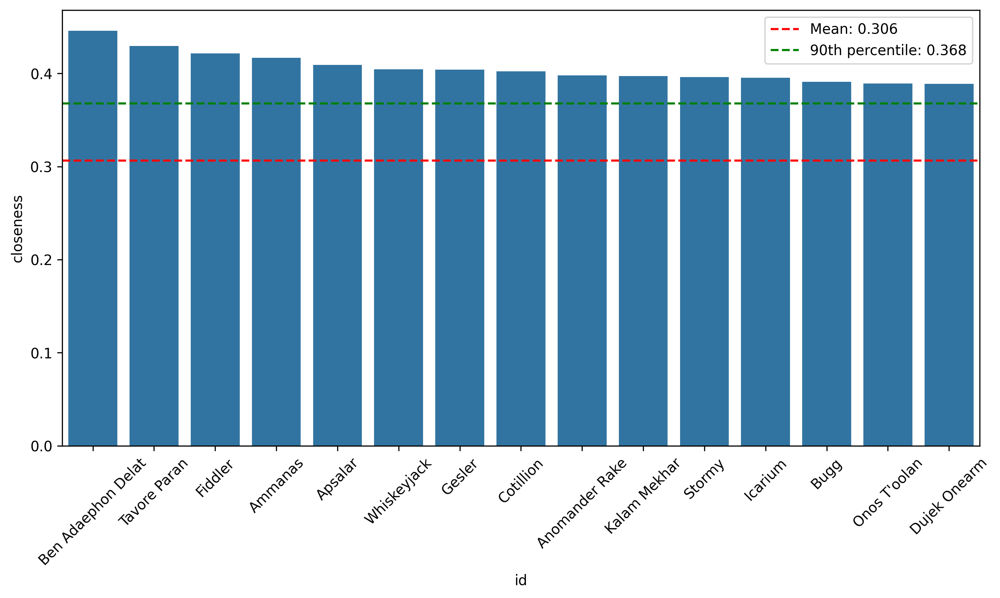
  
    | id                 | gender   | info                                                                                                                                                                                                                                    | profession   |   total_words_count |   books_appearance |   first_book_appearance |   last_book_appearance | affiliation_first   | race_first   |    degree |   closeness |   betweenness |   eigenvector |   pagerank |   core_number |   k_clique_percolation |   louvain_community |   asyn_lpa_community |
    |:-------------------|:---------|:----------------------------------------------------------------------------------------------------------------------------------------------------------------------------------------------------------------------------------------|:-------------|--------------------:|-------------------:|------------------------:|-----------------------:|:--------------------|:-------------|----------:|------------:|--------------:|--------------:|-----------:|--------------:|-----------------------:|--------------------:|---------------------:|
    | Ben Adaephon Delat | Male     | aka Quick Ben, enigmatic Bridgeburner squad mage later High Mage                                                                                                                                                                        | High Mage    |               31253 |                  6 |                       1 |                     10 | Malazan Empire      | Human        | 0.137662  |    0.445799 |    0.107166   |     0.210665  | 0.0105899  |            15 |                     14 |                   1 |                    0 |
    | Tavore Paran       | Female   | Adjunct to Empress Laseen, Commander of the Malazan 14th Army, sister of Ganoes and Felisin                                                                                                                                             | Commander    |                2145 |                  2 |                       6 |                     10 | Malazan Empire      | Human        | 0.142857  |    0.429545 |    0.094029   |     0.217211  | 0.0111748  |            15 |                     13 |                   6 |                    1 |
    | Fiddler            | nan      | renowned sapper, 9th Squad, Bridgeburners, later Sergeant 14th Army, 8th Legion, 9th Company, 4th Squad, then Captain                                                                                                                   | Captain      |              103197 |                  6 |                       2 |                     10 | Malazan Empire      | Human        | 0.12987   |    0.421496 |    0.0686403  |     0.224605  | 0.00921249 |            15 |                      1 |                   7 |                    0 |
    | Ammanas            | Male     | , an Ascendant, ruler of Shadow, King of High House Shadow, aka Shadowthrone, aka Kellanved founder and Emperor of the Malazan Empire, aka Wu (mage)                                                                                    | Mage         |                2457 |                  3 |                       4 |                     10 | nan                 | Human        | 0.0753247 |    0.416763 |    0.035159   |     0.129632  | 0.00605959 |            14 |                      1 |                   1 |                    0 |
    | Apsalar            | Female   | -, aka Sorry, aka not-Apsalar, 9th Squad, Bridgeburners, an assassin                                                                                                                                                                    | Assassin     |               32604 |                  3 |                       1 |                      6 | nan                 | Human        | 0.0792208 |    0.409181 |    0.0313532  |     0.151144  | 0.00588279 |            15 |                      7 |                   1 |                    0 |
    | Whiskeyjack        | nan      | once went by Jack, sergeant of the Bridgeburners' 9th squad, Old Guard, aka Iskar Jarak, past 2nd Army Commander                                                                                                                        | Guard        |               47344 |                  2 |                       1 |                      3 | Malazan Empire      | Human        | 0.0779221 |    0.404278 |    0.0178751  |     0.143569  | 0.00586063 |            14 |                      1 |                   1 |                    0 |
    | Gesler             | Male     | ex-corporal Costal Guard, Sergeant, 9th Company, 8th Legion, Malazan 14th Army, attached to the K'Chain Che'Malle as Mortal Sword                                                                                                       | Mortal Sword |               18783 |                  5 |                       4 |                     10 | Malazan Empire      | Human        | 0.102597  |    0.404058 |    0.0459056  |     0.178655  | 0.00723979 |            15 |                     17 |                   7 |                    0 |
    | Cotillion          | Male     | aka The Rope, Assassin of High House Shadow, Companion to Shadowthrone, Patron god of assassins                                                                                                                                         | God          |               14951 |                  5 |                       4 |                     10 | nan                 | Human        | 0.0662338 |    0.402306 |    0.0451787  |     0.0935866 | 0.00598369 |            14 |                     10 |                   9 |                    0 |
    | Anomander Rake     | Male     | -, a Soletaken Tiste Andii Eleint, Ascendant, brother of Silchas Ruin and Andarist, leader of the Tiste Andii in Black Coral, aka Anomandaris Purake, First Son of Darkness,  Lord of Moon's Spawn, Son of Darkness, Knight of Darkness | Ascendant    |                4076 |                  3 |                       1 |                      8 | nan                 | Tiste Andii  | 0.0831169 |    0.397778 |    0.0520967  |     0.0977678 | 0.00758383 |            14 |                     10 |                   1 |                    2 |
    | Kalam Mekhar       | Male     | 9th Squad Bridgburners, assassin,  ex-Claw from Seven Cities                                                                                                                                                                            | Assassin     |              102930 |                  5 |                       1 |                     10 | Malazan Empire      | Human        | 0.0779221 |    0.397353 |    0.0284638  |     0.140003  | 0.006363   |            14 |                      1 |                   1 |                    0 |
    | Stormy             | Male     | ex-coastal guard, Corporal, 5th squad, 9th Coy., 8th Legion, Malazan 14th Army, ex-Adjutant, attached to K'Chain Che'Malle as Shield Anvil                                                                                              | Shield Anvil |                8892 |                  3 |                       7 |                     10 | Malazan Empire      | Human        | 0.0649351 |    0.39608  |    0.0151196  |     0.132863  | 0.00452409 |            15 |                      1 |                   7 |                    0 |
    | Icarium            | Male     | a Jhag, aka Lifestealer, Builder of the Wheel of Ages in Darujihistan                                                                                                                                                                   | nan          |               13267 |                  3 |                       6 |                      9 | nan                 | Jhag         | 0.0506494 |    0.395447 |    0.0333549  |     0.05928   | 0.00471482 |            12 |                      1 |                   8 |                   10 |
    | Bugg               | nan      | Tehol Beddict's manservant                                                                                                                                                                                                              | Manservant   |               22520 |                  4 |                       5 |                     10 | nan                 | nan          | 0.0597403 |    0.391072 |    0.0456339  |     0.0653895 | 0.00552768 |            13 |                     16 |                   8 |                   15 |
    | Onos T'oolan       | Male     | aka Tool, First Sword of the Logros Imass, Warleader of the White Face Barghast, Hetan's husband, father of Absi                                                                                                                        | Warleader    |               14398 |                  3 |                       3 |                     10 | Malazan Empire      | T'lan Imass  | 0.0558442 |    0.389226 |    0.058899   |     0.0660044 | 0.00584408 |            14 |                     11 |                   5 |                    3 |
    | Dujek Onearm       | nan      | High Fist, Commander of Onearm's Host later the renegade Malaz 5th Army                                                                                                                                                                 | Commander    |                1024 |                  1 |                       3 |                      3 | Malazan Empire      | Human        | 0.0636364 |    0.388819 |    0.00877269 |     0.121318  | 0.00470875 |            14 |                      1 |                   1 |                    2 |

  

  
  

  
Betweenness Centrality

  
  
    | id                 | gender   | info                                                                                                                                                                                                                                    | profession   |   total_words_count |   books_appearance |   first_book_appearance |   last_book_appearance | affiliation_first      | race_first   |    degree |   closeness |   betweenness |   eigenvector |   pagerank |   core_number |   k_clique_percolation |   louvain_community |   asyn_lpa_community |
    |:-------------------|:---------|:----------------------------------------------------------------------------------------------------------------------------------------------------------------------------------------------------------------------------------------|:-------------|--------------------:|-------------------:|------------------------:|-----------------------:|:-----------------------|:-------------|----------:|------------:|--------------:|--------------:|-----------:|--------------:|-----------------------:|--------------------:|---------------------:|
    | Ben Adaephon Delat | Male     | aka Quick Ben, enigmatic Bridgeburner squad mage later High Mage                                                                                                                                                                        | High Mage    |               31253 |                  6 |                       1 |                     10 | Malazan Empire         | Human        | 0.137662  |    0.445799 |     0.107166  |     0.210665  | 0.0105899  |            15 |                     14 |                   1 |                    0 |
    | Tavore Paran       | Female   | Adjunct to Empress Laseen, Commander of the Malazan 14th Army, sister of Ganoes and Felisin                                                                                                                                             | Commander    |                2145 |                  2 |                       6 |                     10 | Malazan Empire         | Human        | 0.142857  |    0.429545 |     0.094029  |     0.217211  | 0.0111748  |            15 |                     13 |                   6 |                    1 |
    | Fiddler            | nan      | renowned sapper, 9th Squad, Bridgeburners, later Sergeant 14th Army, 8th Legion, 9th Company, 4th Squad, then Captain                                                                                                                   | Captain      |              103197 |                  6 |                       2 |                     10 | Malazan Empire         | Human        | 0.12987   |    0.421496 |     0.0686403 |     0.224605  | 0.00921249 |            15 |                      1 |                   7 |                    0 |
    | Onos T'oolan       | Male     | aka Tool, First Sword of the Logros Imass, Warleader of the White Face Barghast, Hetan's husband, father of Absi                                                                                                                        | Warleader    |               14398 |                  3 |                       3 |                     10 | Malazan Empire         | T'lan Imass  | 0.0558442 |    0.389226 |     0.058899  |     0.0660044 | 0.00584408 |            14 |                     11 |                   5 |                    3 |
    | Anomander Rake     | Male     | -, a Soletaken Tiste Andii Eleint, Ascendant, brother of Silchas Ruin and Andarist, leader of the Tiste Andii in Black Coral, aka Anomandaris Purake, First Son of Darkness,  Lord of Moon's Spawn, Son of Darkness, Knight of Darkness | Ascendant    |                4076 |                  3 |                       1 |                      8 | nan                    | Tiste Andii  | 0.0831169 |    0.397778 |     0.0520967 |     0.0977678 | 0.00758383 |            14 |                     10 |                   1 |                    2 |
    | Brys Beddict       | Male     | Letherii, Finadd and King's Champion, youngest of the Beddict brothers, Commander of the Letherii Army                                                                                                                                  | Champion     |               58943 |                  4 |                       5 |                     10 | Kingdom of Lether      | Human        | 0.074026  |    0.383198 |     0.0469647 |     0.0788487 | 0.00696695 |            13 |                     16 |                   8 |                   15 |
    | Gesler             | Male     | ex-corporal Costal Guard, Sergeant, 9th Company, 8th Legion, Malazan 14th Army, attached to the K'Chain Che'Malle as Mortal Sword                                                                                                       | Mortal Sword |               18783 |                  5 |                       4 |                     10 | Malazan Empire         | Human        | 0.102597  |    0.404058 |     0.0459056 |     0.178655  | 0.00723979 |            15 |                     17 |                   7 |                    0 |
    | Bugg               | nan      | Tehol Beddict's manservant                                                                                                                                                                                                              | Manservant   |               22520 |                  4 |                       5 |                     10 | nan                    | nan          | 0.0597403 |    0.391072 |     0.0456339 |     0.0653895 | 0.00552768 |            13 |                     16 |                   8 |                   15 |
    | Cotillion          | Male     | aka The Rope, Assassin of High House Shadow, Companion to Shadowthrone, Patron god of assassins                                                                                                                                         | God          |               14951 |                  5 |                       4 |                     10 | nan                    | Human        | 0.0662338 |    0.402306 |     0.0451787 |     0.0935866 | 0.00598369 |            14 |                     10 |                   9 |                    0 |
    | Trull Sengar       | nan      | a Tiste Edur warrior, master of spear-fighting, betrothed to Seren Pedac                                                                                                                                                                | Warrior      |               73101 |                  4 |                       4 |                      7 | nan                    | Tiste Edur   | 0.0701299 |    0.368914 |     0.0449158 |     0.040935  | 0.0067595  |            11 |                     15 |                   9 |                   16 |
    | Gruntle            | nan      | a caravan guard, Mortal Sword of Trake/Treach, Shareholder, Trygalle Trade Guild                                                                                                                                                        | Mortal Sword |               53110 |                  3 |                       3 |                     10 | Trygalle Trade Guild   | Human        | 0.0688312 |    0.371127 |     0.0428485 |     0.0623925 | 0.00635134 |            14 |                     11 |                   5 |                   26 |
    | Karsa Orlong       | Male     | a Teblor Toblakai warrior of the Uryd Tribe of the Teblor, Sha’ik’s bodyguard, Army of the Apocalypse                                                                                                                                   | Bodyguard    |              106663 |                  5 |                       4 |                     10 | Army of the Apocalypse | Teblor       | 0.0415584 |    0.357541 |     0.0421588 |     0.039982  | 0.00451436 |            12 |                      1 |                   3 |                   28 |
    | Rhulad Sengar      | nan      | Tiste Edur, aka Emperor of a Thousand Deaths, youngest Son of Tomad Sengar and Uruth                                                                                                                                                    | Emperor      |                2592 |                  2 |                       5 |                      7 | nan                    | Tiste Edur   | 0.074026  |    0.376206 |     0.0419372 |     0.0499649 | 0.00681204 |            11 |                      2 |                   8 |                   16 |
    | Ammanas            | Male     | , an Ascendant, ruler of Shadow, King of High House Shadow, aka Shadowthrone, aka Kellanved founder and Emperor of the Malazan Empire, aka Wu (mage)                                                                                    | Mage         |                2457 |                  3 |                       4 |                     10 | nan                    | Human        | 0.0753247 |    0.416763 |     0.035159  |     0.129632  | 0.00605959 |            14 |                      1 |                   1 |                    0 |
    | Icarium            | Male     | a Jhag, aka Lifestealer, Builder of the Wheel of Ages in Darujihistan                                                                                                                                                                   | nan          |               13267 |                  3 |                       6 |                      9 | nan                    | Jhag         | 0.0506494 |    0.395447 |     0.0333549 |     0.05928   | 0.00471482 |            12 |                      1 |                   8 |                   10 |

  

  

  
Katz Centrality

  
  
    | id                 | gender   | info                                                                                                                                                 | profession   |   total_words_count |   books_appearance |   first_book_appearance |   last_book_appearance | affiliation_first   | race_first   |    degree |   closeness |   betweenness |   eigenvector |   pagerank |   core_number |   k_clique_percolation |   louvain_community |   asyn_lpa_community |
    |:-------------------|:---------|:-----------------------------------------------------------------------------------------------------------------------------------------------------|:-------------|--------------------:|-------------------:|------------------------:|-----------------------:|:--------------------|:-------------|----------:|------------:|--------------:|--------------:|-----------:|--------------:|-----------------------:|--------------------:|---------------------:|
    | Fiddler            | nan      | renowned sapper, 9th Squad, Bridgeburners, later Sergeant 14th Army, 8th Legion, 9th Company, 4th Squad, then Captain                                | Captain      |              103197 |                  6 |                       2 |                     10 | Malazan Empire      | Human        | 0.12987   |    0.421496 |    0.0686403  |      0.224605 | 0.00921249 |            15 |                      1 |                   7 |                    0 |
    | Tavore Paran       | Female   | Adjunct to Empress Laseen, Commander of the Malazan 14th Army, sister of Ganoes and Felisin                                                          | Commander    |                2145 |                  2 |                       6 |                     10 | Malazan Empire      | Human        | 0.142857  |    0.429545 |    0.094029   |      0.217211 | 0.0111748  |            15 |                     13 |                   6 |                    1 |
    | Ben Adaephon Delat | Male     | aka Quick Ben, enigmatic Bridgeburner squad mage later High Mage                                                                                     | High Mage    |               31253 |                  6 |                       1 |                     10 | Malazan Empire      | Human        | 0.137662  |    0.445799 |    0.107166   |      0.210665 | 0.0105899  |            15 |                     14 |                   1 |                    0 |
    | Gesler             | Male     | ex-corporal Costal Guard, Sergeant, 9th Company, 8th Legion, Malazan 14th Army, attached to the K'Chain Che'Malle as Mortal Sword                    | Mortal Sword |               18783 |                  5 |                       4 |                     10 | Malazan Empire      | Human        | 0.102597  |    0.404058 |    0.0459056  |      0.178655 | 0.00723979 |            15 |                     17 |                   7 |                    0 |
    | Bottle             | Male     | a squad mage, 9th Company, 4th squad, 8th Legion, Malazan 14th Army                                                                                  | Mage         |               62131 |                  5 |                       4 |                     10 | Malazan Empire      | Human        | 0.0727273 |    0.382803 |    0.0109678  |      0.158942 | 0.00467658 |            15 |                      1 |                   7 |                    0 |
    | Apsalar            | Female   | -, aka Sorry, aka not-Apsalar, 9th Squad, Bridgeburners, an assassin                                                                                 | Assassin     |               32604 |                  3 |                       1 |                      6 | nan                 | Human        | 0.0792208 |    0.409181 |    0.0313532  |      0.151144 | 0.00588279 |            15 |                      7 |                   1 |                    0 |
    | Whiskeyjack        | nan      | once went by Jack, sergeant of the Bridgeburners' 9th squad, Old Guard, aka Iskar Jarak, past 2nd Army Commander                                     | Guard        |               47344 |                  2 |                       1 |                      3 | Malazan Empire      | Human        | 0.0779221 |    0.404278 |    0.0178751  |      0.143569 | 0.00586063 |            14 |                      1 |                   1 |                    0 |
    | Kalam Mekhar       | Male     | 9th Squad Bridgburners, assassin,  ex-Claw from Seven Cities                                                                                         | Assassin     |              102930 |                  5 |                       1 |                     10 | Malazan Empire      | Human        | 0.0779221 |    0.397353 |    0.0284638  |      0.140003 | 0.006363   |            14 |                      1 |                   1 |                    0 |
    | Keneb              | Male     | Captain, Fist Malazan 14th Army                                                                                                                      | Captain      |               29149 |                  5 |                       2 |                      9 | Malazan Empire      | Human        | 0.0623377 |    0.374876 |    0.00784607 |      0.13705  | 0.004315   |            15 |                     17 |                   6 |                    1 |
    | Stormy             | Male     | ex-coastal guard, Corporal, 5th squad, 9th Coy., 8th Legion, Malazan 14th Army, ex-Adjutant, attached to K'Chain Che'Malle as Shield Anvil           | Shield Anvil |                8892 |                  3 |                       7 |                     10 | Malazan Empire      | Human        | 0.0649351 |    0.39608  |    0.0151196  |      0.132863 | 0.00452409 |            15 |                      1 |                   7 |                    0 |
    | Ammanas            | Male     | , an Ascendant, ruler of Shadow, King of High House Shadow, aka Shadowthrone, aka Kellanved founder and Emperor of the Malazan Empire, aka Wu (mage) | Mage         |                2457 |                  3 |                       4 |                     10 | nan                 | Human        | 0.0753247 |    0.416763 |    0.035159   |      0.129632 | 0.00605959 |            14 |                      1 |                   1 |                    0 |
    | Deadsmell          | nan      | marine and medium infantry, Corporal Malazan 14th Army, 8th Legion, 9th Company, 9th Squad                                                           | Infantry     |                6886 |                  2 |                       9 |                     10 | Malazan Empire      | Human        | 0.061039  |    0.364029 |    0.0080191  |      0.124747 | 0.00368138 |            15 |                      1 |                   7 |                    0 |
    | Balm               | nan      | Sergeant, Malazan 14th Army, 8th Legion, 9th Company, 9th Squad, Medium Infantry                                                                     | Infantry     |                5970 |                  4 |                       6 |                     10 | Malazan Empire      | Human        | 0.0675325 |    0.358231 |    0.0125981  |      0.124383 | 0.00429992 |            15 |                      1 |                   7 |                    0 |
    | Dujek Onearm       | nan      | High Fist, Commander of Onearm's Host later the renegade Malaz 5th Army                                                                              | Commander    |                1024 |                  1 |                       3 |                      3 | Malazan Empire      | Human        | 0.0636364 |    0.388819 |    0.00877269 |      0.121318 | 0.00470875 |            14 |                      1 |                   1 |                    2 |
    | Cuttle             | Male     | a sapper, 4th squad, 9th Company, 8th Legion, Malazan 14th Army, 4th Squad                                                                           | Sapper       |                7923 |                  4 |                       6 |                     10 | Malazan Empire      | Human        | 0.0506494 |    0.359098 |    0.00345116 |      0.119144 | 0.00310503 |            15 |                      1 |                   7 |                    0 |

  

  
- **Page-Rank**:
  - 

    
Click to expand table

    
    
    | id                 | gender   | info                                                                                                                                                                                                                                    | profession   |   total_words_count |   books_appearance |   first_book_appearance |   last_book_appearance | affiliation_first    | race_first   |    degree |   closeness |   betweenness |   eigenvector |   pagerank |   core_number |   k_clique_percolation |   louvain_community |   asyn_lpa_community |
    |:-------------------|:---------|:----------------------------------------------------------------------------------------------------------------------------------------------------------------------------------------------------------------------------------------|:-------------|--------------------:|-------------------:|------------------------:|-----------------------:|:---------------------|:-------------|----------:|------------:|--------------:|--------------:|-----------:|--------------:|-----------------------:|--------------------:|---------------------:|
    | Tavore Paran       | Female   | Adjunct to Empress Laseen, Commander of the Malazan 14th Army, sister of Ganoes and Felisin                                                                                                                                             | Commander    |                2145 |                  2 |                       6 |                     10 | Malazan Empire       | Human        | 0.142857  |    0.429545 |     0.094029  |     0.217211  | 0.0111748  |            15 |                     13 |                   6 |                    1 |
    | Ben Adaephon Delat | Male     | aka Quick Ben, enigmatic Bridgeburner squad mage later High Mage                                                                                                                                                                        | High Mage    |               31253 |                  6 |                       1 |                     10 | Malazan Empire       | Human        | 0.137662  |    0.445799 |     0.107166  |     0.210665  | 0.0105899  |            15 |                     14 |                   1 |                    0 |
    | Fiddler            | nan      | renowned sapper, 9th Squad, Bridgeburners, later Sergeant 14th Army, 8th Legion, 9th Company, 4th Squad, then Captain                                                                                                                   | Captain      |              103197 |                  6 |                       2 |                     10 | Malazan Empire       | Human        | 0.12987   |    0.421496 |     0.0686403 |     0.224605  | 0.00921249 |            15 |                      1 |                   7 |                    0 |
    | Anomander Rake     | Male     | -, a Soletaken Tiste Andii Eleint, Ascendant, brother of Silchas Ruin and Andarist, leader of the Tiste Andii in Black Coral, aka Anomandaris Purake, First Son of Darkness,  Lord of Moon's Spawn, Son of Darkness, Knight of Darkness | Ascendant    |                4076 |                  3 |                       1 |                      8 | nan                  | Tiste Andii  | 0.0831169 |    0.397778 |     0.0520967 |     0.0977678 | 0.00758383 |            14 |                     10 |                   1 |                    2 |
    | Gesler             | Male     | ex-corporal Costal Guard, Sergeant, 9th Company, 8th Legion, Malazan 14th Army, attached to the K'Chain Che'Malle as Mortal Sword                                                                                                       | Mortal Sword |               18783 |                  5 |                       4 |                     10 | Malazan Empire       | Human        | 0.102597  |    0.404058 |     0.0459056 |     0.178655  | 0.00723979 |            15 |                     17 |                   7 |                    0 |
    | Brys Beddict       | Male     | Letherii, Finadd and King's Champion, youngest of the Beddict brothers, Commander of the Letherii Army                                                                                                                                  | Champion     |               58943 |                  4 |                       5 |                     10 | Kingdom of Lether    | Human        | 0.074026  |    0.383198 |     0.0469647 |     0.0788487 | 0.00696695 |            13 |                     16 |                   8 |                   15 |
    | Rhulad Sengar      | nan      | Tiste Edur, aka Emperor of a Thousand Deaths, youngest Son of Tomad Sengar and Uruth                                                                                                                                                    | Emperor      |                2592 |                  2 |                       5 |                      7 | nan                  | Tiste Edur   | 0.074026  |    0.376206 |     0.0419372 |     0.0499649 | 0.00681204 |            11 |                      2 |                   8 |                   16 |
    | Trull Sengar       | nan      | a Tiste Edur warrior, master of spear-fighting, betrothed to Seren Pedac                                                                                                                                                                | Warrior      |               73101 |                  4 |                       4 |                      7 | nan                  | Tiste Edur   | 0.0701299 |    0.368914 |     0.0449158 |     0.040935  | 0.0067595  |            11 |                     15 |                   9 |                   16 |
    | Kalam Mekhar       | Male     | 9th Squad Bridgburners, assassin,  ex-Claw from Seven Cities                                                                                                                                                                            | Assassin     |              102930 |                  5 |                       1 |                     10 | Malazan Empire       | Human        | 0.0779221 |    0.397353 |     0.0284638 |     0.140003  | 0.006363   |            14 |                      1 |                   1 |                    0 |
    | Gruntle            | nan      | a caravan guard, Mortal Sword of Trake/Treach, Shareholder, Trygalle Trade Guild                                                                                                                                                        | Mortal Sword |               53110 |                  3 |                       3 |                     10 | Trygalle Trade Guild | Human        | 0.0688312 |    0.371127 |     0.0428485 |     0.0623925 | 0.00635134 |            14 |                     11 |                   5 |                   26 |
    | Ammanas            | Male     | , an Ascendant, ruler of Shadow, King of High House Shadow, aka Shadowthrone, aka Kellanved founder and Emperor of the Malazan Empire, aka Wu (mage)                                                                                    | Mage         |                2457 |                  3 |                       4 |                     10 | nan                  | Human        | 0.0753247 |    0.416763 |     0.035159  |     0.129632  | 0.00605959 |            14 |                      1 |                   1 |                    0 |
    | Cotillion          | Male     | aka The Rope, Assassin of High House Shadow, Companion to Shadowthrone, Patron god of assassins                                                                                                                                         | God          |               14951 |                  5 |                       4 |                     10 | nan                  | Human        | 0.0662338 |    0.402306 |     0.0451787 |     0.0935866 | 0.00598369 |            14 |                     10 |                   9 |                    0 |
    | Apsalar            | Female   | -, aka Sorry, aka not-Apsalar, 9th Squad, Bridgeburners, an assassin                                                                                                                                                                    | Assassin     |               32604 |                  3 |                       1 |                      6 | nan                  | Human        | 0.0792208 |    0.409181 |     0.0313532 |     0.151144  | 0.00588279 |            15 |                      7 |                   1 |                    0 |
    | Whiskeyjack        | nan      | once went by Jack, sergeant of the Bridgeburners' 9th squad, Old Guard, aka Iskar Jarak, past 2nd Army Commander                                                                                                                        | Guard        |               47344 |                  2 |                       1 |                      3 | Malazan Empire       | Human        | 0.0779221 |    0.404278 |     0.0178751 |     0.143569  | 0.00586063 |            14 |                      1 |                   1 |                    0 |
    | Onos T'oolan       | Male     | aka Tool, First Sword of the Logros Imass, Warleader of the White Face Barghast, Hetan's husband, father of Absi                                                                                                                        | Warleader    |               14398 |                  3 |                       3 |                     10 | Malazan Empire       | T'lan Imass  | 0.0558442 |    0.389226 |     0.058899  |     0.0660044 | 0.00584408 |            14 |                     11 |                   5 |                    3 |

    

  - *Correlation comparison of centralities and prestige*
    

    
Click to show plots

    
    
    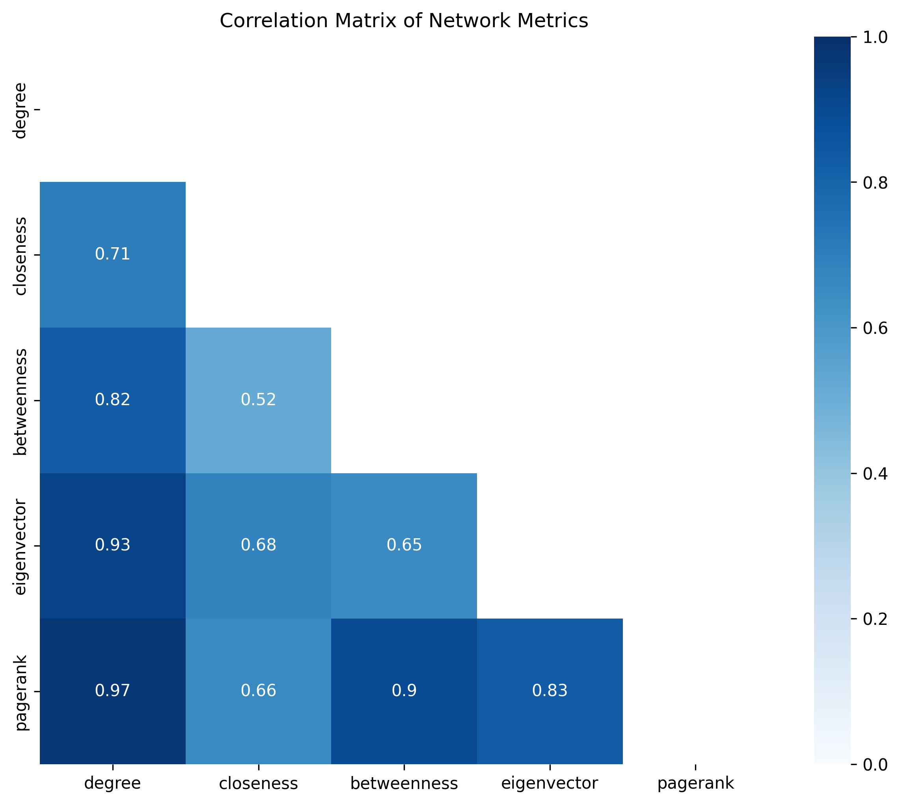
    

- **Assortative Mixing**:
  

  
Gender

  
  

  

  
Race

  
  

  

  
Affiliation

  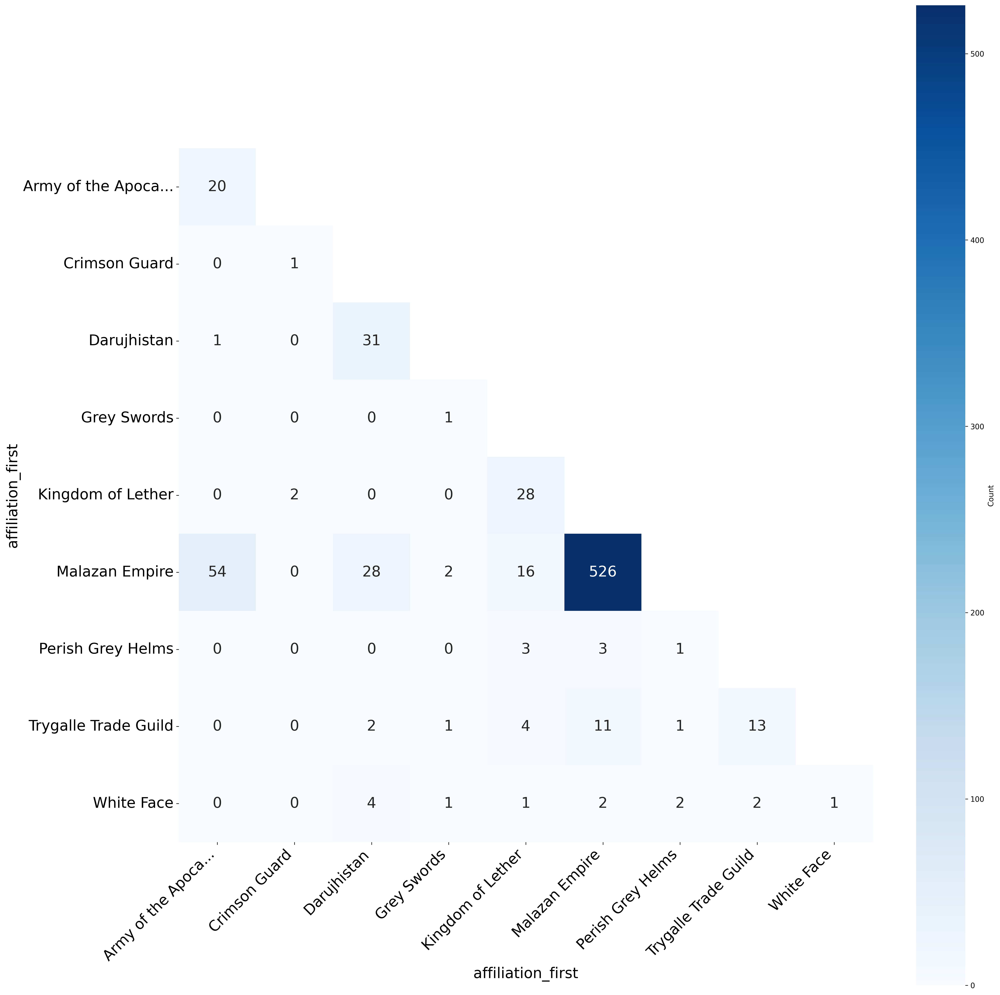
  

- **Node structural equivalence/similarity**:
  

  
Jaccard Similarity

  
  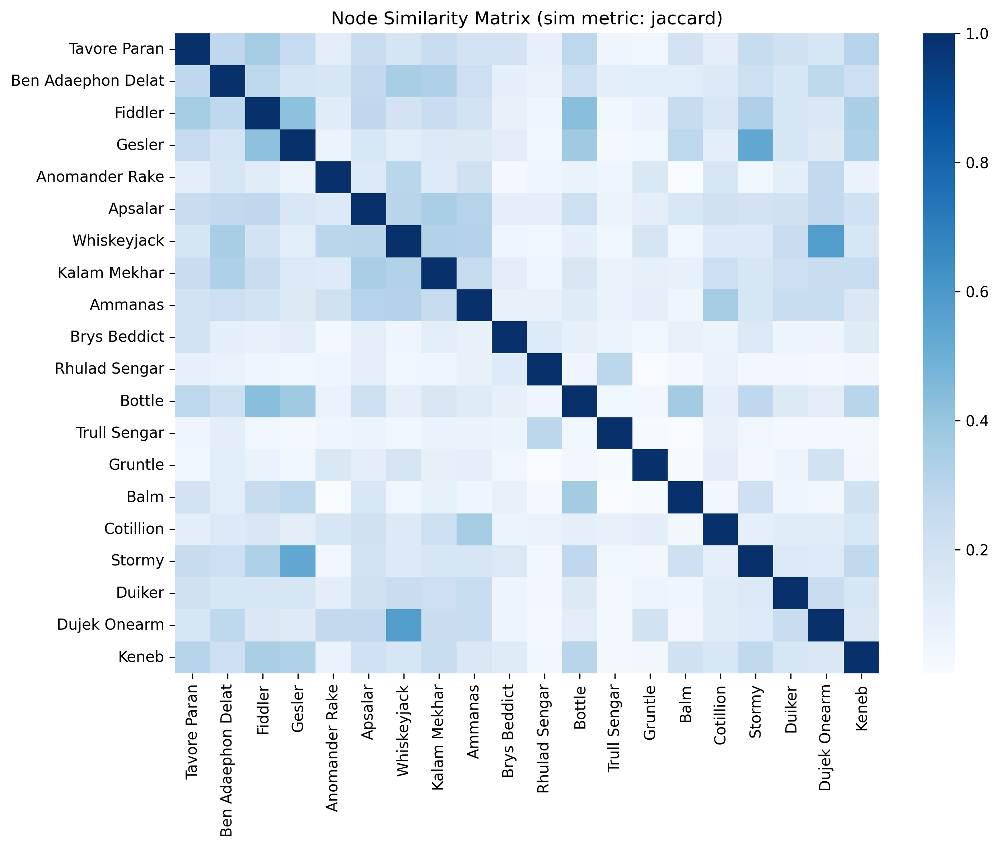
  

  

  
Cosine Similarity

  
  

- **Edges weights between top nodes**
  

  
Click to show plot

  
  

**Results Interpretation:**

Interestingly, among top 3 personae ranked by *centrality measures*, only Fiddler is also in the top of POV words count.
The reason for that lies in the way Steven Erikson wanted us to perceive Quick Ben and Tavore. The former masterminded
many convergences without us realising that (due to the lack of POV), while the latter was (and is) an unsolved mistery
(we did not really get to know her well enough; and that was purposeful).
Nevertheless, these two are of utmost importance for the events in the Book and thus they have communicated with the
great number of other people. What made them different from, say Anomander Rake or Shadowthrone (Ammanas), whose role
was instrumental as well, was the fact that they underwent more targeted actions and communications, while Tavore and
Quick Ben were always in the middle of something themselves (apart from being a part of the big and highly-connected army).

It is also amusing how *Page-Rank* algorithm pushed Anomander Rake, Brys Beddict, and brother Sengars to the top, though
truth be told, I expected to see Ganoes Paran and Tehol Beddict here as well (perhaps they would've appeared in the
top had we considered the 10th book). The reason for this reshuffle is that those characters are big shots that
communicated actively with the other big shots. All of them are at the top of some organisations.
Other than that Centralities are mostly highly-correlated.

Speaking of *Assortative Mixing*, we can well see that were a lot of intergender communications (assortativity coefficient
is around 0), which is to be expected, given Steven's desire to make the Book free of prejudices (that is, without
discrimination based on gender, race, skin color, etc.). *Race Mixing Matrix* shows us that most of the contacts are
between Malazans. In the end, they are the central history-makers. The same situation can be observed in *Affiliation
Mixing Matrix*.

Brushing upon *node structural equivalence* (using cosine similarity), it can be well seen that our favorite Malazans
(Quick Ben, Fiddler, Gesler, Whiskeyjack, Tavore) are quite similar to one another. No wonder, given that they crossed
the continents and the seas hand in hand (being thus in the same milieu and forming common bonds of friendship).

## Community Detection

Clique Size Distribution

    ## Clique Size Distribution
    
    |   Size |   Count |
    |-------:|--------:|
    |     15 |       2 |
    |     13 |       8 |
    |     12 |      10 |
    |     11 |      24 |
    |     10 |      58 |
    |      9 |     104 |
    |      8 |     177 |
    |      7 |     204 |
    |      6 |     216 |
    |      5 |     220 |
    |      4 |     254 |
    |      3 |     226 |
    |      2 |     185 |

K-cores Visualization

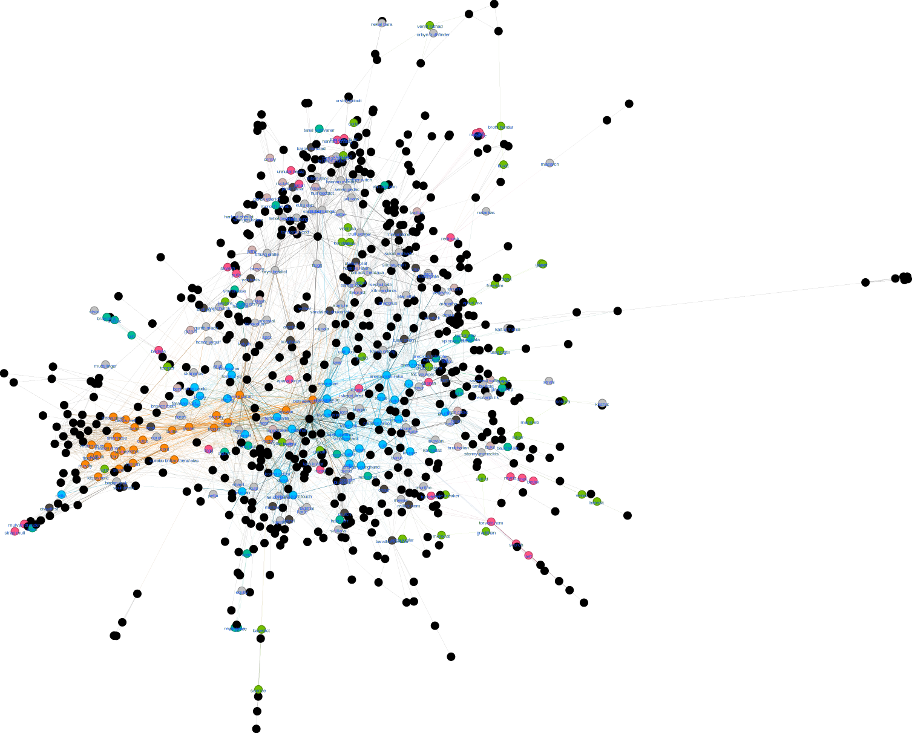

K-percolation community detection algorithm

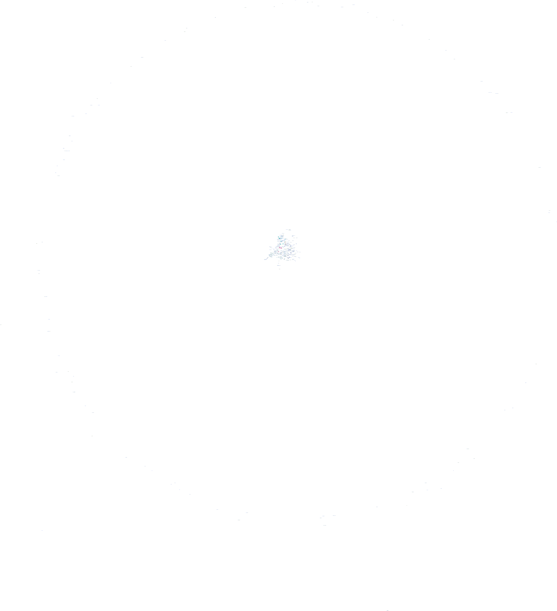

Louvain community detection algorithm

**Results Interpretation:**

*Louvain community detection* algorithm appears to work really well in case of the Malazan Book (Modularity: 0.5628).

Take a look:

- Community 0 (Darujhistan Heroes): Apsalar, Kruppe, Cutter, Baruk, Rallick Nom, Murillio, etc.
- Community 3: Olar Ethil, Cotillion, Silchas Ruin, Kilmandaros, Menandore, Clip, Sechul Lath, Aparal Forge, Korabas, and others.
  As we can see, this community is comprised mostly by characters in the status of legends that got well acquainted with
  each other over the millennia.
- Community 4: consists of Fokrul Assails only.
- Community 7: mostly Malazans (Bridgeburners) and their close allies.
- Community 9: other Malazan heavies and marines.
- Community 10: main actors on the Lether continent (Tiste Edures and Letherii).

## References

Expand references

  Erikson, S. (1999). *Gardens of the Moon*. London: Bantam Press.
  
  Erikson, S. (2000). *Deadhouse Gates*. London: Bantam Press.
  
  Erikson, S. (2001). *Memories of Ice*. London: Bantam Press.
  
  Erikson, S. (2002). *House of Chains*. London: Bantam Press.
  
  Erikson, S. (2004). *Midnight Tides*. London: Bantam Press.
  
  Erikson, S. (2006). *The Bonehunters*. London: Bantam Press.
  
  Erikson, S. (2007). *Reaper's Gale*. London: Bantam Press.
  
  Erikson, S. (2008). *Toll the Hounds*. London: Bantam Press.
  
  Erikson, S. (2009). *Dust of Dreams*. London: Bantam Press.
  
  Cedarosaurus. (2018, November 30). Main series character POV data [Reddit post]. r/Malazan.  
  https://www.reddit.com/r/Malazan/comments/a1ukxk/main_series_character_pov_data/
  
  Malazan Wiki. (n.d.). *Malazan Wiki*. Fandom.  
  https://malazan.fandom.com/wiki/Malazan_Wiki
  
  visuelledata. (n.d.). *malazannetwork*. GitHub.  
  https://github.com/visuelledata/malazannetwork/

  Bastian, M., Heymann, S., & Jacomy, M. (2009). Gephi: An open source software for exploring and manipulating networks. *International AAAI Conference on Weblogs and Social Media*.
 
 